# Marketplace Application

My application is not fully functioning in Heroku because of an error in active blob. 
To be able to access the fully functional applciaiton of my app here's the link and try to clone my repo.

### Installation
Clone the repository in your local computer. Here's how you can clone it. [Clone Repository](https://docs.github.com/en/repositories/creating-and-managing-repositories/cloning-a-repository). After cloning it then:

Run bundle install
Run rails db:migrate

### R7. Identification of the problem you are trying to solve by building this particular marketplace app.

My marketplace application is a two-sided marketplace app for collectors items where users can either buy or sell new or used collectible product. 

### R8. Why is it a problem that needs solving?

There are less to none marketplace that is build for collectors so I'm trying to build this app where all collectors will be able to easily sell or buy a collectibles they want from trading cards, model kits, action figures and Pop!Vinyl. 

R9. A link (URL) to your deployed app (i.e. website)

[Marketplace App](https://polar-crag-67168.herokuapp.com/)

Here's a test card number for buy option:
Number | CVC | Date
--- | --- | ---
4242424242424242 | Any 3 digits | Any future date
5555555555554444 | Any 3 digits | Any future date 

### R10. A link to your GitHub repository (repo)

[GitHub](https://github.com/adrianalain/Marketplace_T2A2)

### R11. Description of your maketplace app (website), including:
  

#### Who can sell products in this app:

People can sell products in the app if they have a collectors items, from trading cards, model kits, action figures, comic books, POP! Vinyl, cars. They can sell new or used products.

#### Features/Functionality of the marketplace app are:
- Simple Sign up process
- Create/Sell a product
- View a product
- Payment getaways (Stripe)
- Delete a product you sell
- Edit a product information
  
### Sitemap

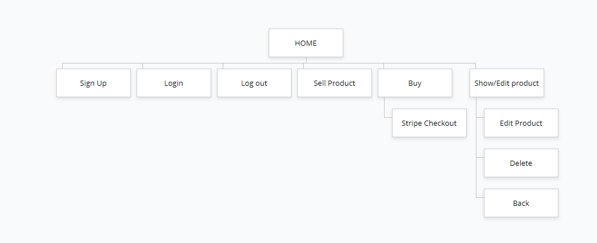

### Screenshots

#### HomePage_NoAccount
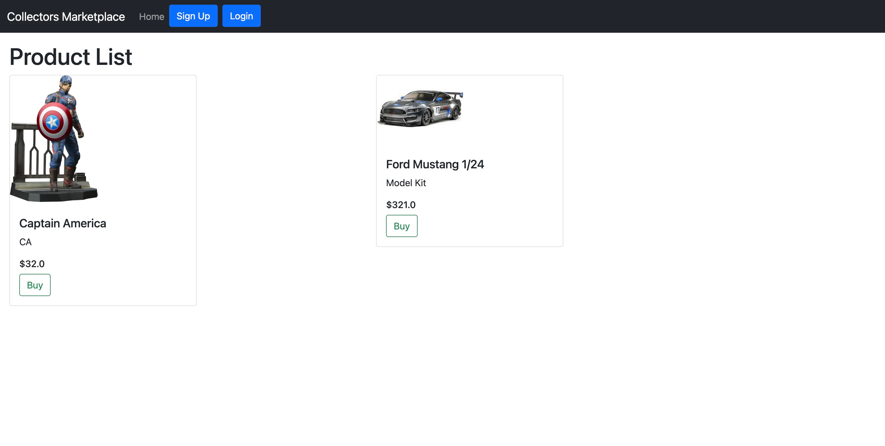

#### LoginPage
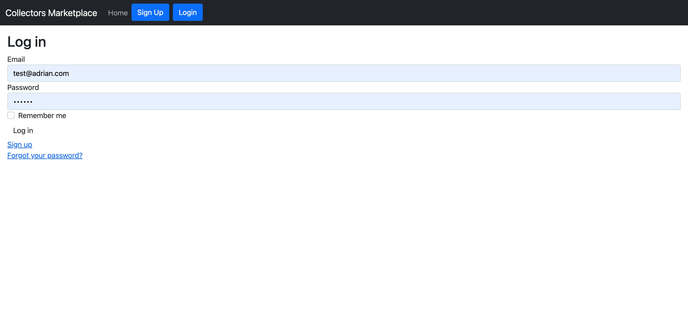

#### SignupPage
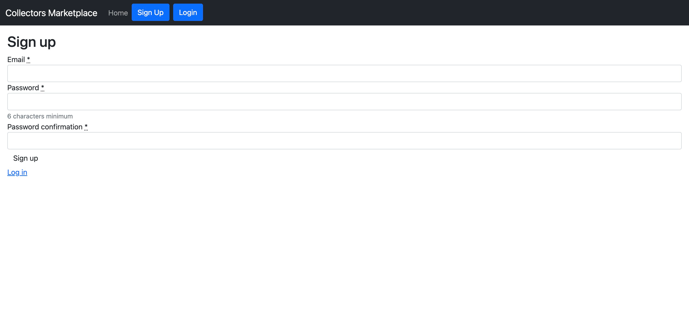

#### HomePage
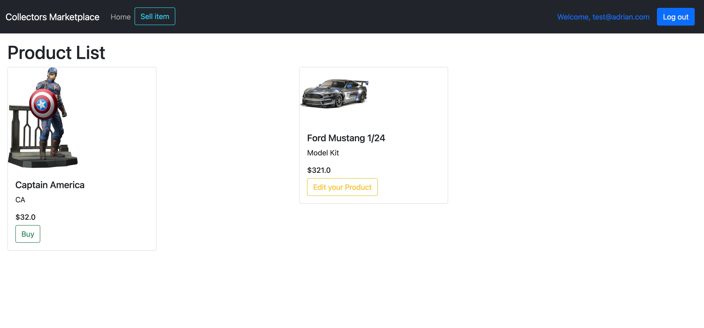

#### CreatePage

#### EditPage
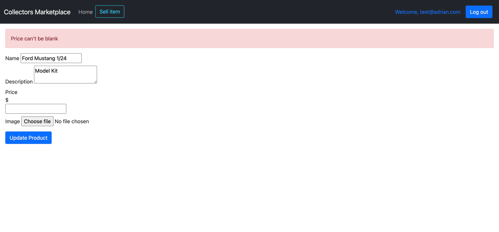

#### ShowPage
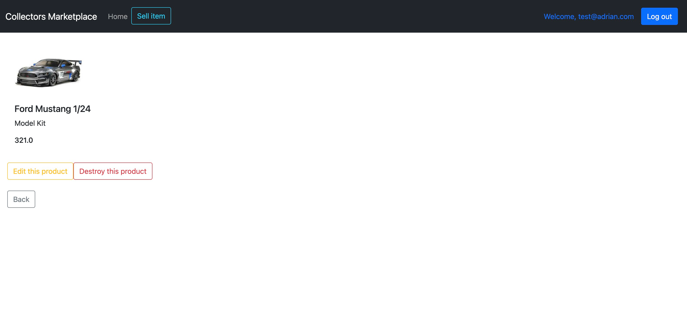

#### Payment
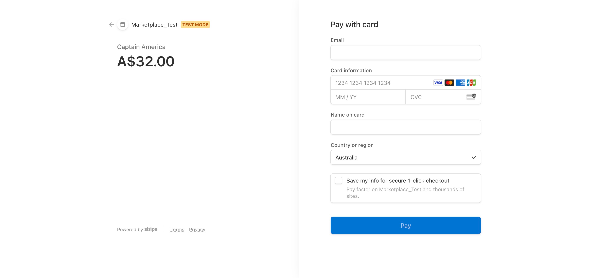

### Target Audience
 - My target audience are teenagers to adults who are fond in collectors item.
  
### User stories for your app.

As a/an | I want to... | So that ... 
--- | --- | ---
seller | create an account | I am uniquely identified within my product
seller & buyer | edit my profile | i can update my information
seller | have CRUD functionality | I can easily view the information about my product
buyer | have a search option | I can easily navigate what I need
buyer | have option to create an account | I can can find the ones I want to buy
buyer | view images and details of each product | I can know more about the infomation of the product
buyer | have an account | I can see my account details and past orders

Wireframe of your app.

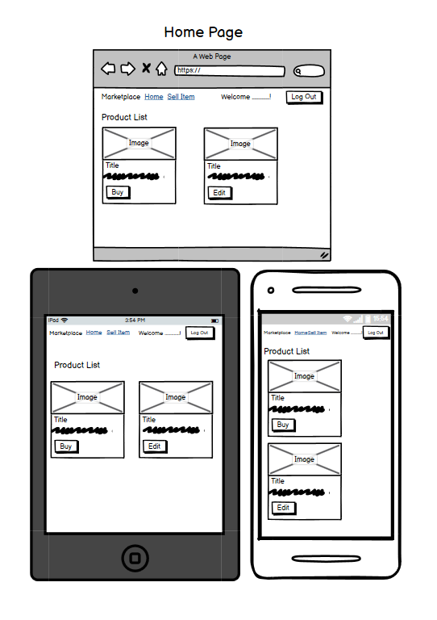

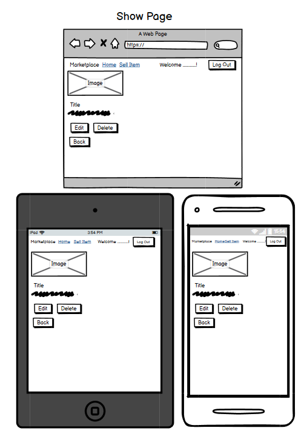

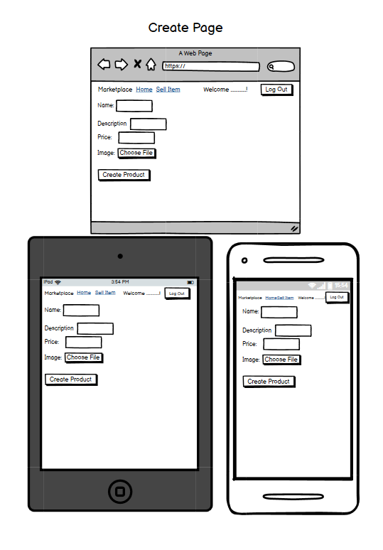

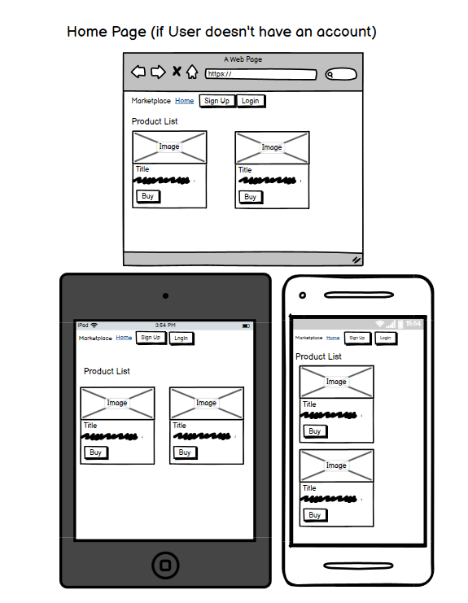

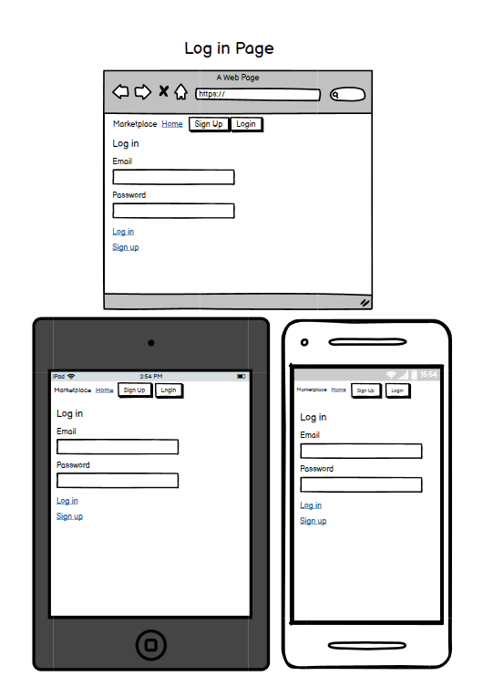

#### Tech Stack
Tech Stack | Use
--- | ---
HTML & Boostrap CSS | Front end design
Ruby on Rails | server-side web application framework
Ruby | Object oriented programming language

#### Third Party Services

3rd Party Service | Use
--- | ---
Heroku | Cloud web-hosting
GitHub | Software version control
Cloudinary | cloud-based storage for images

#### Gems

Rails Gems | Use
--- | ---
Devise | Authentication
simple_form  | Components to create forms
rails-erd | Generates an ERD based on the active record models
stripe  | Payment processing platform

Describe your projects models in terms of the relationship (active record association) they have with each other.

User has only one account but has many products. Each product belongs to one user and has one attached image.

### Provide your database schema design

#### Database Schema Models

Model Name | Purpose 
--- | --- 
Users | Email & password
Products | name, description, price, image, use_id
Active_storage_attachments | images for sell product  

### Discuss the database relations to be implemented in your application.

#### Database Relations

Model 1 | Relationship | Model 2
--- | --- | ---
user | has_many | product
product | has_one_attached | image
product | belongs_to | user
product | belongs_to | user

### ERD of your app.

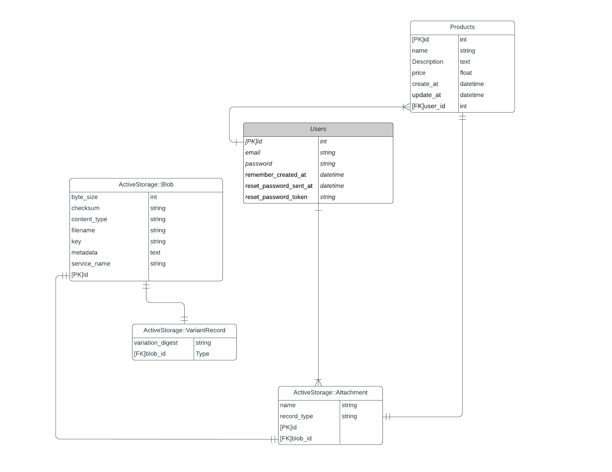

The image above is the ERD for my marketplace application. This is used as a blueprint for the database and to prevent data redundancy. As shown above, the Users and the Products entities has one to many relationship. In the Products entity, it uses the user_id as the foreign key for Users entity's id.

### Describe the way tasks are allocated and tracked in your project.

I used trello to plan and track the tasks that are requiredfor development. Each tasks was planned and tracked through each stage; to do, on going, done and optional. The tasks were allocated with a specific due date.

Here's my trello board:
[Trello](https://trello.com/b/jzdzOxnJ/marketplaceapp)

